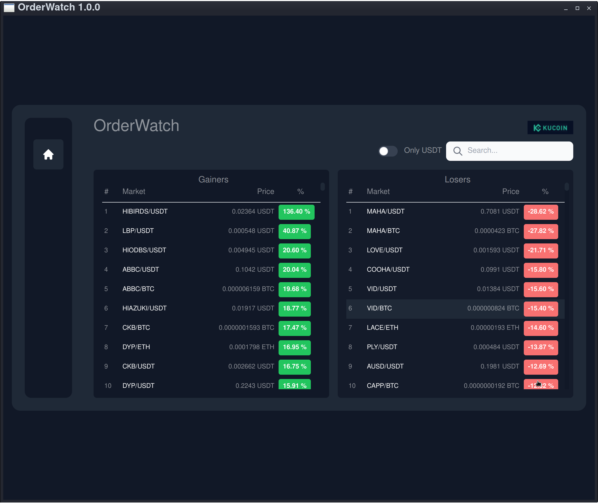
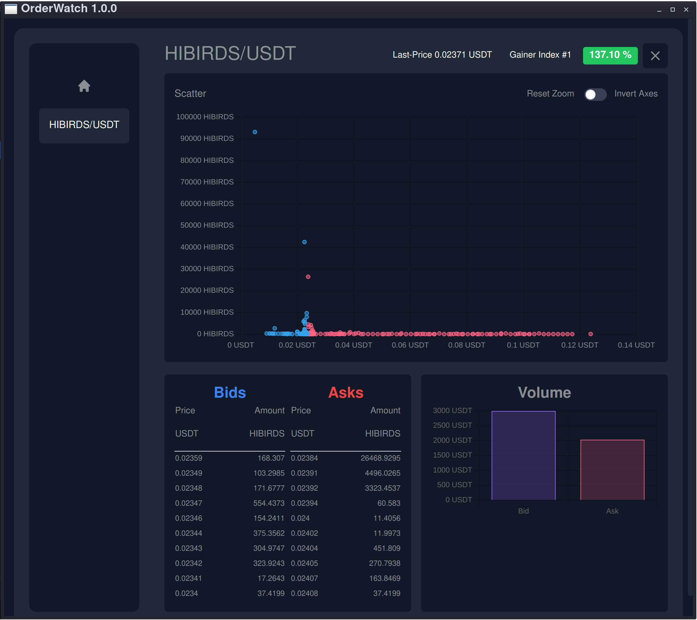

# OrderWatch

A Simple Visualization of KuCoins OrderBook with a Scatter Chart.  
It uses the greate CCXT as the basis for data collection.

## Market

## OrderBook


The latest version for Win, Linux and Mac can be found under [Releases](https://github.com/zer0x2k/OrderWatch/releases).

## CORS
Some exchanges block API traffic for third-party WebApps.  
This can be simpel byPassed with a Electron App or a CORS proxy.  

## Development
```bash
#Install dependencys
npm install
#Run the Build
npm run build
#Run a Electron
npm run start-electron
```

## Licence 
It's free, buy me a coffee if you like :)

BTC: bc1qkpsqfkmzqwshdy9g2lfa308l2k3h2x2fq5w83j  
ETH: 0xE59dfD85aF47461A32536c596734e874009485f3  
